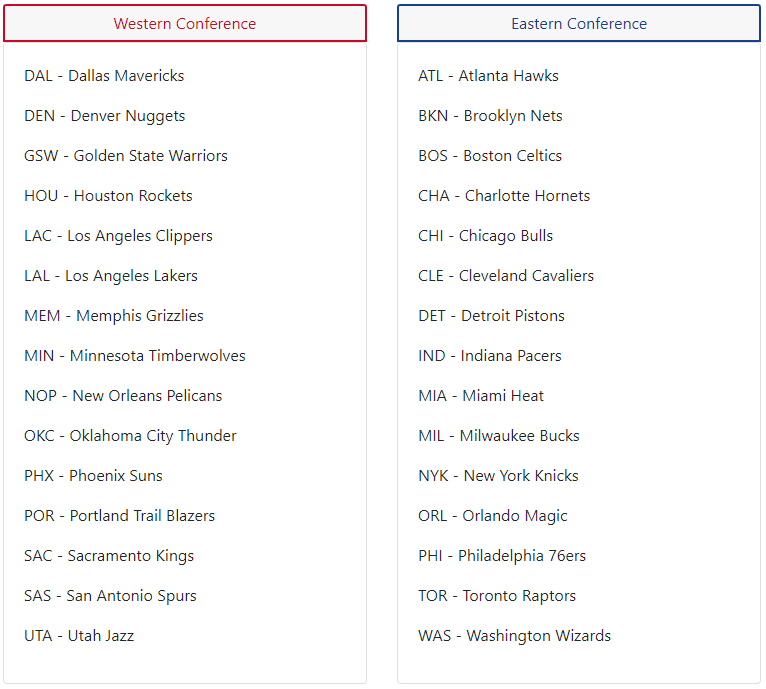

# Predicting the 2020 NBA Playoffs
[Predicting the 2020 NBA Playoffs Homepage](https://hanesy.github.io/NBA_Playoffs/)

  	
  
  

## INTRODUCTION
For our final project, we decided to predict the teams that would have made it do the playoffs in 2020. We used historical data of games statistics since the 1980 playoffs to base our prediction.

Every regular season, there are 30 teams divided into two conferences: Western and Eastern. Each team plays 82 games per season - 41 home and 41 away. At the end of the regular season, the eight teams with the most wins in each conference qualify for the playoffs.

We decided to compare the results of 3 different models to do our predictions, and see which model would be the most accurate.

## NBA HISTORY
To explain a major “what” and “why” in the data set we chose, the major WHAT being the start date range we chose for our data sourcing. That start is the **1979-1980** season. We chose this date because this is the year that the NBA implemented the 3-point line. The 3-point line was employed to increase the chances for shorter players to earn more points and to expand the defense away from the basket.

We chose the 3-point line because it repeatedly showed up with a relatively high level of importance in our Machine Learning scores, leading us to feel it was a watershed moment ushering in what we consider the Modern Basketball era.

During the review of the data we also wanted to observe other major disruptors in the NBA’s rules or in NBA data due to outliers. In doing this we would like to specifically point out two occasions of a lockout in the 1999 season and the 2011 season, as these shortened seasons could potentially affect our machine learning; as well as two rule changes in 2001: (1) The permission of zone defense and (2) the implementation of the 3-second rule.

Zone defense allows defensive players to play particular zoned areas of the court, where previously NBA required man-to-man defense. This change is believed to have increased the effectiveness of NBA defenses, which would directly affect our machine learning.

3-second rule requires that an offensive player may not remain in the opponents foul lane for more than 3-seconds – ultimately stopping players from planting themselves under the net waiting to be passed the ball for an easy lay-up. Improving movement on the court and easing pressure on the defense. Affecting both offensive and defensive stats in our machine learning.

## SOURCE DATA
To build our models, we wanted to be able to pull as much data as possible to optimize machine learning. After reviewing various NBA data sites, we chose [basketball-reference.com/](https://www.basketball-reference.com/).

Reasoning:

 * Most robust data tables
 * Longest history of data
 * High accuracy (spot checked against data on NBA.com and ESPN.com)
 * Low level of complexity/Javascript on the website, allowing us to scrape without a web driver (chromedriver)

To scrape the data we used HTML parsing with Python’s Beautifulsoup to build a JSON table per our specified date-range to go year-by-year (e.g. page-by-page) to scrape and parse the data needed from two separate tables housed on each year’s summary page (example: [2020 League Stats](https://www.basketball-reference.com/leagues/NBA_2020.html)):

 * Conference Standings – Collect ‘conference’, ‘wins’, and ‘losses’
 * Team Per Game Stats – Collect all other per-game average statistics
 
This data was then written into a CSV file for Machine Learning analysis.

## BUILDING THE MODELS
We developed three different types of models, Logistic Regression, Random Forest, and Support Vector Machine (SVM).

**Data Preprocessing**

Each performance statistic of the regular season data was scaled using a quantile transformer by each year (all columns except RK, Team, Year, Games, and Conference) and normalized. This transformed the data so the performance statistic was comparable for each season.

We used two variations of game wins - count of wins and losses versus win rate.

**Training and Testing**

We split the regular season data by Eastern and Western conferences. From the split data, 1980 to 2018 was used to train the model. We tested the trained models against the 2019 season. Finally, we predicted 2020 playoff teams based on the statistics from the incomplete season

## MODEL SCORES
Each model was run with all performance statistics, but with varied structure for game wins. Each model was trained twice: first, with the scaled and and normalized data, then with the count of game wins and losses, and once with the % of wins.

We found that using the scaled and normalized count of wins and losses generally improved the model scores.

## FEATURE IMPORTANCE
Game outcomes (whether wins, losses, or w%) is the most important feature of all the models.

 * Defensive rebounds (DRB) is an important feature for almost all models, for both conferences.
 * Steals (STL) and turnovers (TOV) are important features for the logistic and SVM models, for both conferences.
 * 2-pointers percentage (2P%) and field goals percentage (FG%) are important features for the random forest models, for both conferences.
 * 2-pointer attempted (2PA) is an important factor negatively correlated with outcomes for all models in the Eastern conference.
 * Free throws attempted (FTA) is an important factor positively correlated with outcomes with the svm model in the Western conference.

## 2019 PREDICTIONS
The model predictions for the 2019 season showed that the Eastern Conference models were better at predicting the teams more precisely than the Western Conference models. The teams that made it to the playoffs are listed in rank order under the "2019 Actual" column.

Teams with higher than .5 probability are listed below in descending order. If there were fewer than 8 teams that meet this criteria, the team with the next highest probability was listed until 8 teams were selected.

Red indicates false predictions.

## 2020 PREDICTIONS
Given that only four teams had clinched a playoff spot before the season was cancelled, there is no ground truth for this set of predictions. However, we thought it would be interesting to see what could have been.

 * The team ranks for 2020 at time of the NBA shutdown is listed under "2020 Partial" column.
 * Western conference models predicted more than 8 teams, but the top 8 predicted by the models were the same.
 * Eastern conference models predicted the same 8 teams would make the playoffs.

The teams with higher than .5 probability are listed below in descending order.

\* indicates teams that have made it to the playoffs.

## 2020 FINAL PREDICTIONS
We averaged all six models to determine which teams we think would have made it into the playoffs for 2020. All four teams that had already clinched playoff spots (marked with an asterisk) were at the top of the lists (though not necessarily in the same order).

## CONCLUSION
Using Logistic, Random Forest and Support Vector Machine as tools of Machine Learning (ML) we found that all provided similar predictions, whether the importance of the independent values were the same or not. Though, if you look at our section ‘Feature Importance’ you’ll see the strongest values are related to either ‘Win’, ‘Loss’, or ‘W%’ (win percentage); which we believe should be expected in predicting a teams likelihood of earning a place within the Playoffs.

When we removed the WL/W% from the models, we found that defensive stats played a much larger role in the model. Steals (STL), defensive rebounds (DRB), turnovers (TOV) all increase in importance while providing similar predictive results and accuracy.

We ran numerous tests for previous years showing similar results, with a high rate of accuracy (with some inconsistency in 1999 and 2011 during NBA lockouts). With that being said, with the amount of data we currently collect and model, we feel that we have built three models that can predict playoff contention with a ‘strong’ level of accuracy of telling who from each conference will participate in the NBA Playoffs.

## NEXT STEPS
**Improving the Model**

If we had more time with these models, there are several more things we’d like to try.

 * There is a lot of data we could add to the model, like player info or strength of schedule.
 * We could also narrow down the features used in each model to determine what really is important and what isn’t.

**Continued Testing of Accuracy**

We could use these models year-over-year with mid-season statistics to prove accuracy.

**Improving 2020 Prediction Results**

Instead of using averaging of our models, we would like to utilize Ensemble Learning using Bagging, Boosting and Stacking to provide better accuracy in combining our results.

**Future Models**

The natural next step would be to make a model that uses regular season and playoff game data to predict not only who makes it to the playoffs, but who wins the whole thing.

## ADDITIONAL INFORMATION
**Statistics Abbreviations**

**Team Abbreviations**

## OUR TEAM
Dagney Cooke - ([LinkedIn](https://www.linkedin.com/in/dagney-cooke-4119b156/)) ([Github](https://github.com/dagneycooke))

Shaymus McTeague - ([LinkedIn](https://www.linkedin.com/in/shaymusm/)) ([Github](https://github.com/shaymusmc))

Diana Silva - ([LinkedIn](https://www.linkedin.com/in/dianalvesilva/)) ([Github](https://github.com/dialsilv))

Heain Yee - ([LinkedIn](https://www.linkedin.com/in/heain-yee-82105818/)) ([Github](https://github.com/hanesy))